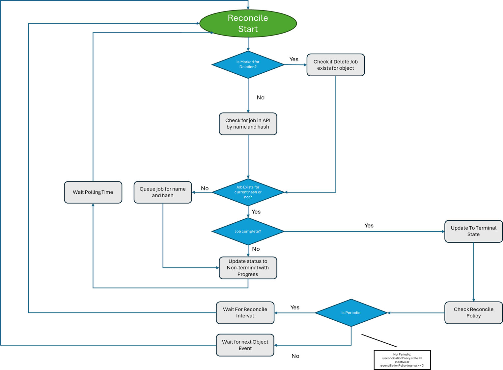

# Solution manager

_(last edit: 6/28/2023)_

Solution manager implements core Symphony state-seeking logic. It takes a [deployment](../concepts/unified-object-model/deployment.md) spec, plans deployment steps, and invokes corresponding [target providers](../providers/target_provider.md) to drive system states towards the desired state.

Solution manager is the only stateful component in the Symphony system. When you scale out solution manager, you need to configure your solution manager instances to use a shared state store.

## Deployment planning

Because Symphony allows dependencies among [solution](../concepts/unified-object-model/solution.md) components, and supports mapping solution components to multiple [target](../concepts/unified-object-model/target.md) components, the solution manager goes through a planning process to make sure these components are applied in the desired order. This planning process builds an assignment matrix first, and then generates deployment steps. For example, a solution has three components `a`, `b` and `c`. Components `a` and `c` are Helm charts, and `b` is a container. The solution is to be deployed to two targets, `T1` and `T2`. Target `T1` is a Kubernetes cluster, and `T2` is a Docker container host. Also, in this case component `c` has a dependency on `b`. The assignment matrix looks like this:

|  |T1|T2|
|--|--|--|
|a|1|0|
|b|0|1|
|c|1|0|

The above matrix is converted to three deployment steps:

1. Deploy `a` using Helm to `T1`.
2. Deploy `b` using Docker to `T2`.
3. Deploy `c` using Helm to `T1`.

Symphony also tries to combine deployment steps as long as the component dependencies are not violated. For example, if `c` doesn't have a dependency on `b`, Symphony will combine Step 1 and Step 3 into one step:

1. Deploy `[a, c]` using Helm to `T1`.
2. Deploy `b` using Docker to `T2`.

> **NOTE**: At the moment, all deployment steps are executed sequentially. In future versions, there could be optimizations to parallelize some steps, such as steps 1 and 2 above.

## Deployment summary

Solution manager generates a deployment summary at the end of a reconciliation operation. The summary provides per-target status as well as per-component status. The summary is associated with a timestamp as well as the instance objects' generation number.

When using a in-memory store, Symphony maintains the generation number as an ever-increasing version number whenever the object is updated. When using a Kubernetes store, Symphony takes the object generation number from Kubernetes.

## Deployment summary caching

Solution manager caches the lasted deployment summary per instance and allows the summary to be queried. A client can decide to use the cache as the deployment state (within certain time window with matching generation number, for instance) instead of trying to queue additional reconciliation jobs.

```go
summary, err := api_utils.GetSummary("http://symphony-service:8080/v1alpha2/", "admin", "", instance.ObjectMeta.Name)
generationMatch := true
if v, err := strconv.ParseInt(summary.Generation, 10, 64); err == nil {
    generationMatch = v == instance.GetGeneration()
}
if generationMatch && time.Since(summary.Time) <= time.Duration(60)*time.Second { 
    // cache is still fresh
} else {
    // cache is stale/invalidated, queue a new job
    err = api_utils.QueueJob("http://symphony-service:8080/v1alpha2/", "admin", "", instance.ObjectMeta.Name, false, false)
}
```

> **NOTE**: It's still possible to queue duplicated reconciliation jobs. Symphony may consider to include a de-dup mechanism in future versions of the Solution Manager.

## Skip provider operations

Before a deployment step is sent to a provider, Symphony checks the provider's validation rule to see if any of the interested properties are changed. If not, the deployment step is skipped for the provider even if other non-interested properties have changed. For example, if a provider claims that it only cares about a `container.image` property, the provider is called only when this particular property is changed.

## Retry

The solution manager has built-in retry logic to attempt a deployment step three times at a fixed interval (5 seconds) before giving up. In future versions, this retry logic will be extended to allow configurable retry counts and backoff delays.

## Integration with K8S reconciliation

In production, symphony-api will deploy with symphony-k8s. Symphony-k8s leverages k8s reonciliation loop for solution-management. 

And Symphony-k8s exposes fine-grained reonciliation policy control to let callers decide how to reconciliate when current spec is converged to termination state. 

In target and instance k8s spec, caller can define an optional property - reconciliationPolicy.

```yaml
spec:
    reconciliationPolicy:
        state: <active or inactive>
        interval: <optional, e.g. 1m>
```

By default, symphony-k8s will use periodic reconciliation policy, if the caller doesn't explicitly `reconciliationPolicy.interval`, and doesn't set `reconciliationPolicy.state = 'inactive'`, the default interval will be `30m`. 

The caller can disable the periodic reconciliation policy by setting `reconciliationPolicy.interval = 0` or `reconciliationPolicy.state = 'inactive'`.

Whenever an instance or a target is changed, The generation is bumped by the kubernetes API server which in turn triggers a reconciliation on the controllers. We then go through the following steps,

